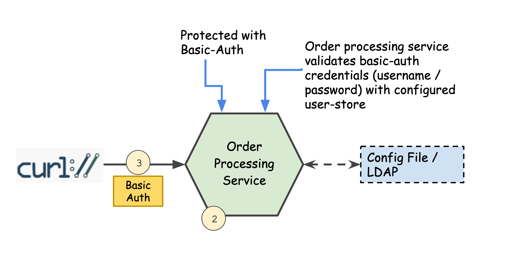

## Securing service with Basic Auth



* **Step:0** Clone the git repo with the following command. If you are new to Ballerina, please check this out: https://ballerina.io/. Ballerina version: 1.1.0

```javascript
:\> git clone https://github.com/prabath/ballerina-security.git
```

* **Step:1** This example directly uses [Secured Service with Basic Auth](https://ballerina.io/learn/by-example/secured-service-with-basic-auth.html) Ballerina by-example (BBE). To download relevant files and setup the BBE locally, run the following command from the directory **service-auth-with-basic-auth**.

```javascript
:\> sh 1-setup-frpm-bbe.sh
```
* **Step:2** To run the Ballerina by-example, run the following command from the directory **service-auth-with-basic-auth**. This will start the service on HTTPS port 9090.

```javascript
:\> sh 2-run-bbe.sh
```
* **Step:5** Run the following command from the directory **service-auth-with-basic-auth** to invoke Ballerina by-example.

```javascript
:\> sh 3-call-bbe.sh

REQUEST 1: 'generalUser1' has 'scope1' only. Hence, this user should not be able to call 'sayHello' resource

HTTP/1.1 403 Forbidden
content-type: text/plain
content-length: 22
server: ballerina/1.1.0
date: Tue, 7 Jan 2020 12:40:39 +0530

Authorization failure.


REQUEST 2: 'generalUser2' has 'scope2' only. Hence, this user should be able to call 'sayHello' resource

HTTP/1.1 200 OK
content-type: text/plain
content-length: 15
server: ballerina/1.1.0
date: Tue, 7 Jan 2020 12:40:39 +0530

Hello, World!!!
```
